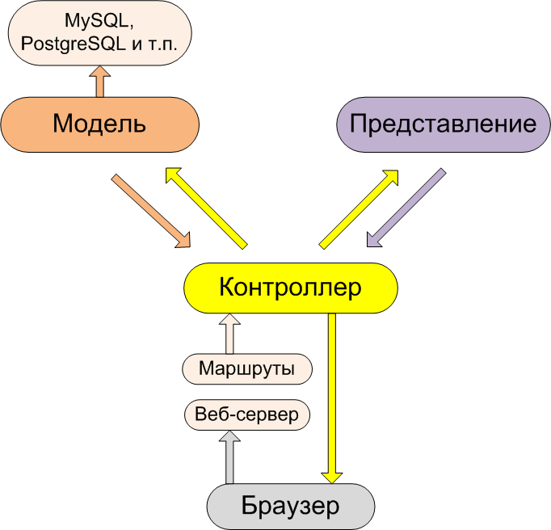

# Model View Controller, Composer и как с "этим" теперь жить?

## Вместо предисловия
`Пишите код так, как будто сопровождать его будет склонный к насилию психопат, который знает, где вы живёте`


## Model View Controller

`Я был готов к нападению любого психа. У меня была вилка.`

**Model-View-Controller** (MVC, «Модель-Представление-Контроллер», «Модель-Вид-Контроллер») — схема разделения данных приложения, 
пользовательского интерфейса и управляющей логики на три отдельных компонента: 
модель, представление и контроллер — таким образом, 
что модификация каждого компонента может осуществляться независимо.

**Модель** (Model) предоставляет данные и реагирует на команды контроллера, изменяя своё состояние.
**Представление** (View) отвечает за отображение данных модели пользователю, реагируя на изменения модели.
**Контроллер** (Controller) интерпретирует действия пользователя, оповещая модель о необходимости изменений.


За счет разделения у нас появляются более широкие возможности повторного использования кода (наследование). Особенно это помогает, когда пользователь должен видеть те же самые данные в различных контекстах и/или с различных точек зрения.

### Схема работы



### Controller

`Я человек простой. Вижу запрос и сразу его обрабатываю!`


По сути задачи контроллера можно разделить на 2 части
1) Обработка запроса **Request**
2) Выдача ответы **Response**

**Controller** является некой "прослойкой" между **Model** и **View**
Существует два понятие это Fat Controllers и Slim Controllers

#### Fat Controller


Характеристика Controller в том случае если большая часть логики(или вся) содержится в контроллере
 


#### Slim Controller


Характеристика Controller при котором вся основная логика сводится к обработке запроса и возвращение ответа.


### View


**View** (Представление) отвечает за получение необходимых данных из модели и отправляет их пользователю. Представление не обрабатывает введённые данные пользователя

Нет! Нельзя в **view** вычислять формулы. 
Нет! Hельзя из **view** делать запросы в базу данный!

**View** оперирует только за отображение данных которые приходят из вне. В данном случае из **Controller**

### Model


Под **Model**, обычно понимается часть содержащая в себе функциональную бизнес-логику приложения. 
Модель должна быть полностью независима от остальных частей продукта. 
Модельный слой ничего не должен знать об элементах дизайна, и каким образом он будет отображаться. 
Достигается результат, позволяющий менять представление данных, то как они отображаются, не трогая саму Модель.

Модель обладает следующими признаками:
- Модель — это бизнес-логика приложения;
- Модель обладает знаниями о себе самой и не знает о контроллерах и представлениях;
- Для некоторых проектов модель — это просто слой данных (DAO, база данных, XML-файл);
- Для других проектов модель — это менеджер базы данных, набор объектов или просто логика приложения;


## Composer


**Composer** — это паке№тный менеджер уровня приложений для языка программирования PHP, который предоставляет средства по управлению зависимостями в PHP-приложении.

В мире PHP существует достаточно много готовых решений. 
Например для работы с кешом на мне обязательно писать свою реализацию, мы можем взять готовую библиотеку или пакет.
Каждый пакет(библиотека) может зависить от другого пакета(библиотеки) той или инной версии.
Composer помогает следить за зависимостями пакетов

Итак, **Composer** — менеджер пакетов для PHP.


Пример реального composer.json для проекта на [Symfony](https://symfony.com/)

```json 
{
    "type": "project",
    "license": "proprietary",
    "require": {
        "php": "^7.1.3",
        "ext-ctype": "*",
        "ext-iconv": "*",
        "api-platform/api-pack": "^1.2",
        "easycorp/easyadmin-bundle": "^2.3",
        "symfony/console": "4.3.*",
        "symfony/dotenv": "4.3.*",
        "symfony/flex": "^1.3.1",
        "symfony/framework-bundle": "4.3.*",
        "symfony/yaml": "4.3.*"
    },
    "require-dev": {
        "symfony/maker-bundle": "^1.14"
    },
    "config": {
        "preferred-install": {
            "*": "dist"
        },
        "sort-packages": true
    },
    "autoload": {
        "psr-4": {
            "App\\": "src/"
        }
    },
    "autoload-dev": {
        "psr-4": {
            "App\\Tests\\": "tests/"
        }
    },
    "replace": {
        "paragonie/random_compat": "2.*",
        "symfony/polyfill-ctype": "*",
        "symfony/polyfill-iconv": "*",
        "symfony/polyfill-php71": "*",
        "symfony/polyfill-php70": "*",
        "symfony/polyfill-php56": "*"
    },
    "scripts": {
        "auto-scripts": {
            "cache:clear": "symfony-cmd",
            "assets:install %PUBLIC_DIR%": "symfony-cmd"
        },
        "post-install-cmd": [
            "@auto-scripts"
        ],
        "post-update-cmd": [
            "@auto-scripts"
        ]
    },
    "conflict": {
        "symfony/symfony": "*"
    },
    "extra": {
        "symfony": {
            "allow-contrib": false,
            "require": "4.3.*"
        }
    }
}

```

Если внимательно посмотреть на пример выше мы можем увидеть что на данный момент Composer может не только устанавливать пакеты но и многое другое

В рамках данного занятия нам нужно рассмотреть только возможность автозагрузки в нашем простом пропекте MVC

Для этого в корне проекта нам нужно запустить следующую коомманду
```bash
composer init
```
В результате должно получится следующий composer.json

```json
{
    "name": "pusachev/mvc", 
    "description": "simple mvc example",
    "type": "project",
    "license": "mit",
    "authors": [
        {
            "name": "Pavel Usachev",
            "email": "pusachev@gmail.com"
        }
    ],
    "autoload": {
        "psr-4": {
            "": "src/"
        }
    },
    "minimum-stability": "stable",
    "require": {}
}
```

- **name** название проекта через / по правилу Namespace/ProjectName. Имя должно быть уникальный по нему composer ищет пакеты [Link](https://getcomposer.org/doc/04-schema.md#name)
- **description** это описание нашего проекта, не обязательно [Link](https://getcomposer.org/doc/04-schema.md#description)
- **type** это наш тип project, lib, package, ect. [Link](https://getcomposer.org/doc/04-schema.md#type)
- **license** Лицензия под которым распространяется проект. [Link](https://getcomposer.org/doc/04-schema.md#license)
- **authors** Автор или авторы разработавшие это решение. [Link](https://getcomposer.org/doc/04-schema.md#authors)
- **autoload** Указывает неймспейс и папку для автозагрузки классов. [Link](https://getcomposer.org/doc/04-schema.md#autoload)
- **minimum-stability** Минимальная версия устанавливаемых пакетов. [Link](https://getcomposer.org/doc/04-schema.md#minimum-stability)
- **require** Список установленных пакетов. [Link](https://getcomposer.org/doc/04-schema.md#require)

Для того что бы нам установило пакеты и сгенерировало autoload нам нужно запустить следующую команду
```bash
composer install
```

Данная комманда генерирует нам файл composer.loc в котором содержатся древо зависимостей
Если файл composer.loc уже сгенерирован, то начнется сразу же установка пакетов

При установке нового пакета или обновлений существующего composer.loc генерируется заново

Для установки нового пакета нужно использовать следующую команду

```bash
composer require symfony/console
```

Данная комманда установит нам пакет [symfony/console](https://symfony.com/doc/current/components/console.html) 
самой последней стабильной версии. Если нам нужно будет установить конкретную версию пакета нам нужно будет указать его версию
```bash
composer require symfony/console@4.5
```

Для обновление отдельно пакета используется следующая команда
```bash
composer update symfony/console
```


## Источники

[Паттерны для новичков: MVC vs MVP vs MVVM](https://habr.com/ru/post/215605/)

[Wikipedia Model-View-Controller](https://ru.wikipedia.org/wiki/Model-View-Controller)

[Composer](https://getcomposer.org/doc/)